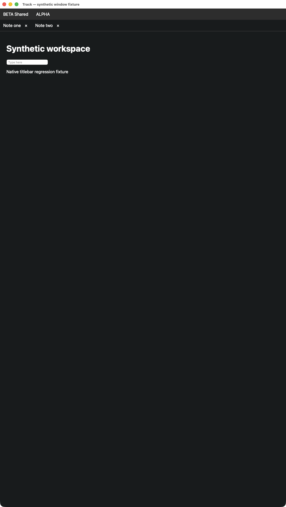
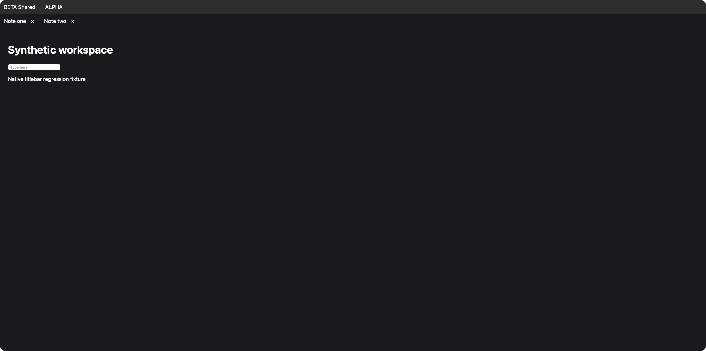

# Content to the top edge

The AppKit shell hides its native title and traffic-light controls, and lets the web
workspace occupy the full window frame. React's note tabs are unchanged.

The window retains the titled, closable, miniaturizable and resizable styles. Its
title remains available to the system and accessibility clients. Using
fullSizeContentView avoids a borderless subclass and preserves normal focus and
window-manager semantics. Content uses the root view's edges, not the titlebar-safe
content layout guide. Background dragging is disabled so the reclaimed region is
available to web controls.

Use Window → Close (⌘W), Minimize (⌘M), Zoom, or Enter Full Screen (⌃⌘F).
Close still passes through the existing delegate and unsaved-work confirmation.
Dragging by a titlebar is no longer available; window-manager movement remains usable.

## Native regression fixture

Run on macOS with an active graphical session:

    python3 scripts/desktop-window-test.py

The bounded test compiles the same chrome helper used by the app, creates a
nonpersistent WKWebView with synthetic HTML, and checks reclaimed frame height,
resize, focus eligibility, accessibility window role, Close delegate delivery,
Minimize and full-screen round trip. It never starts Track's server or reads a vault.

The fixture accepts --before for the original appearance. Set
WINDOW_FIXTURE_SCREENSHOT to a PNG path to capture only its own window using
existing screen-capture permissions; it does not request or change those permissions.

Screenshots from the local fixture show the original white titlebar and the content
at the top after the change. The active window manager assigned different sizes
to the two windows; these are appearance comparisons, not equal-size benchmarks.

This test does not certify every third-party window manager, VoiceOver navigation,
or physical keyboard/mouse interaction.
