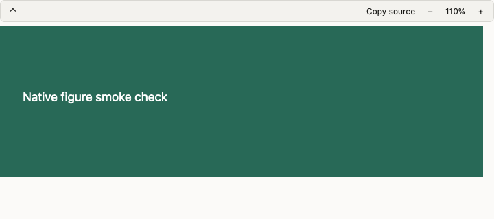

# Native 図表・メディア確認（C14/C15）

2026-09-14。基点 `84e71d0`、`feat/native-figures-media`。SSG は対象外。

## 変更

- FigureHost の初回描画要求を WebKit の準備後に送信する。折り畳んでも操作バーの高さを確保し、拡大した図は横スクロールできる。
- 図表の source を開いて選択・コピーできる。viewspec の失敗は理由・再試行・source を表示し、古い応答を採用しない。
- ECharts の凡例を保ち、datum の外部 source URL を優先して開く。URL がない場合の note provenance は Vault 付き ID を保持する。box 注釈は日付・全文見出し・出典を図の下に表示する。
- メディアに caption/source を表示する。画像拡大は閉じる操作と読込エラーを表示し、PDF は拡大・再試行を追加する。
- 添付の元ファイル名を asset API の `name` から取得する。Mermaid/DOT/D2/drawio/ECharts 添付は既存の図表レンダラーで描き、長いテキストは切り捨てずスクロールする。NUL を含むバイナリはリンクへ戻す。
- `assets/` と `./assets/` のみ Vault asset に解決する。HTML asset は非永続 WKWebView 内の sandbox iframe に置き、`allow-same-origin` と top navigation を許可しない。ネイティブ bridge は設けない。

## 検証

CLT SDK を指定して `swift build --disable-sandbox --package-path native`、`native/.build/debug/VerifyFiguresMedia`、`native/.build/debug/VerifyFiguresMedia --webview` を実行。

通常チェックは、他 Vault の asset query、図表添付の分類、350 行テキストの保持、binary fallback、注釈の見出し・出典、安全な URL と HTML frame 設定を検証する。

`--webview` は macOS の描画プロセス起動のため sandbox 外で実行する。ローカル生成 SVG の初回表示、折り畳み時の native 高さ、110% zoom を実 DOM で確認する。CDN を使わない模擬 chart engine で凡例と provenance callback を確認し、生成 PDF で直接ページ移動と PDFKit からページ欄への同期を確認する。外部 agent・Vault への書込みはしない。

この画像は生成 SVG の動作証跡であり、全レンダラーの見た目の一致を示すものではない。

## 残る確認・制限

- Mermaid/D2/DOT/drawio/KaTeX/Leaflet の CDN 実体、オフライン時の表示、外部 YouTube/Maps/HTML の実コンテンツは未検証。
- box 注釈は全文を保持するリスト表示。Web の軸位置に追従する上下の注釈帯とは異なる。
- mindmap のリンク情報は既存の Mermaid outline 変換のまま。全図内リンクの種類別照合は残る。
- 画像・PDF の拡大は modal。Web の pin/float window と同じ操作体系ではない。
- HTML embed の `:height` / `:frame` 指定、X/Twitter 専用埋込みは今回追加していない。
- PDF/画像/長文の実ノートと preview における外観比較は残る。C14/C15 全体を完了扱いにしない。
