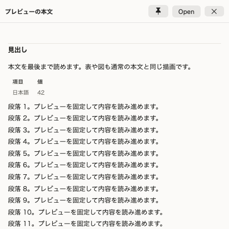
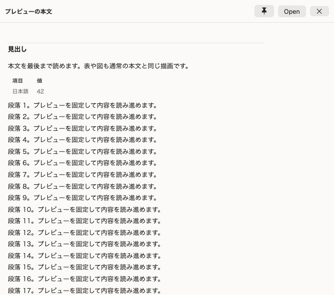

# Native preview / graph checks — 2026-09-14

Scope: C13, C17 and the preview portion of C29–30. Based on `84e71d0`.

The search pin command, aside references, Markdown link rail and graph nodes now use one preview surface. It renders the full note through the existing GFM/figure renderer, resolves links in the source vault, and reports unresolved notes. Hover waits 350 ms. Leaving cancels pending work; the reader transaction rejects cancelled or superseded responses. Each preview owns its reader, so preview navigation preserves the original note and its draft.

The surface is a native resizable panel. It supports pin/unpin, titlebar dragging, closing/Escape and multiple pinned notes. Moving/resizing pins it. Unpinned previews remain while the pointer crosses into the panel. Theme and preview font settings are read by the detached SwiftUI root. The Open action goes through the source surface's existing navigation/dirty guard; opening does not discard the preview.

The graph shares screen-space hit testing between click and hover. Layout runs off the main actor only when the graph changes, while pan/zoom reuse its positions. The 300-node canvas keeps its center/selection. The List contains every received node, including unlinked nodes, shows real titles, and offers **Center in canvas** for nodes outside the overview. The caption reports the canvas cut. Local/full fetches share a generation guard.

## Automated checks

- CLT `swift build --package-path native --disable-sandbox`.
- `scripts/check-native-previews.sh`: delayed/reordered and cancelled loads, cross-vault heading targets, unresolved state, source draft preservation, local graph stale-response rejection, 400-node graph reduction and center/selection retention, hit testing, hover-intent cancellation, multiple native panels, usable panel dimensions, resize/close capability and Escape.
- `VerifyReader`: existing draft/save protection, tabs/search, anchor navigation and editor follow.
- `git diff --check`.

Snapshots are actual `NSPanel` content rendered from the test HTTP fixture, generated with `VerifyPreviews --snapshot-dir <directory>`; they are not mockups. The 460 × 460 and 680 × 600 views show the same heading, table and scrollable long note:

The CLT capture environment reports no screen. A panel preserves its requested dimensions until screen bounds are available, while normal screen constraint behavior remains in AppKit.

## Remaining acceptance work

- Inline links inside MarkdownUI's `Text` do not expose per-link hover locations. The shared hover preview is available on the existing link rail; direct in-paragraph hover remains C13 work. Click navigation is unchanged.
- Graph edges/nodes use a GPU Canvas, which is absent from this environment's `NSHostingView.cacheDisplay` capture. Canvas visual acceptance, pointer movement/pinch and large-graph responsiveness require an interactive app check; the image was excluded from evidence.
- The preview snapshots cover text and tables, not every rich figure/media type. Full rich-media, dark-theme and accessibility/focus acceptance across every floating surface remains part of C15/C29–30.
- Unlike the Web floating layer, native panels do not provide note swapping or collapsed panels. The shared default pin/drag/resize/close workflow is implemented; C13/C29 should remain partial until those intentional differences are reviewed.
