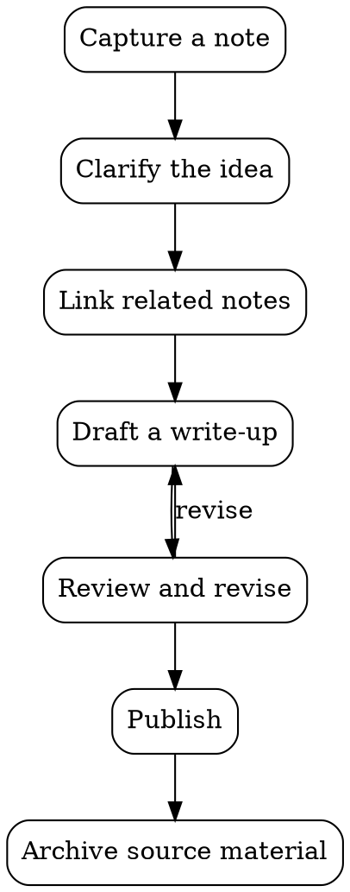

# Diagrams

track renders diagrams as a first-class part of [[Visualization]] — not only statistical [[Charts]].
Three engines are built in, each triggered by its fence language:

- **[Mermaid](https://mermaid.js.org/)** (` ```mermaid `) — **every diagram type Mermaid supports
  works**, because track hands the block straight to the Mermaid library: flowcharts, sequence, class,
  state, entity-relationship, Gantt, pie, user-journey, gitgraph, and the rest.
- **[Graphviz](https://graphviz.org/)** (` ```dot `) — the DOT language with Graphviz's own layout
  engine, for arbitrary graphs where you say *what connects to what* and let the layout be computed.
- **[D2](https://d2lang.com/)** (` ```d2 `) — a modern diagram language with its own themes and
  layout, when you prefer D2's syntax or aesthetics over Mermaid's for the same kind of diagram.

Part of [[Visualization]] (see also [[Charts]], [[Mindmaps]], and [[Embeds]]). Back to [[track]].

## Writing a diagram

Fence a block with `mermaid` and write Mermaid syntax. It renders inline; if the syntax is wrong, the
original source is shown instead of a broken image, so a typo never hides your text.

````markdown

````

It renders as:


## Graphviz

Fence a block with `dot` (or `graphviz`) and write plain [DOT](https://graphviz.org/doc/info/lang.html).
Graphviz runs compiled to WebAssembly, right in the browser — nothing to install — and a syntax error
falls back to the message plus your source, the same as Mermaid:

````markdown

````

It renders as:


The graph background defaults to transparent so it sits on the page in both themes; set `bgcolor`
yourself to override it.

## D2

Fence a block with `d2` and write [D2](https://d2lang.com/tour/intro). Like Graphviz, D2 runs
compiled to WebAssembly in the browser, and a syntax error falls back to the message plus your
source. D2 brings its own themes: track picks a light or dark one to match the app theme, and a
theme set inside the diagram (`vars.d2-config`) still wins:

````markdown
```d2
capture: Capture a note
relate: Link related notes
draft: Draft a write-up
publish: Publish

capture -> relate -> draft -> publish
draft -> capture: gap found
```
````

It renders as:

```d2
capture: Capture a note
relate: Link related notes
draft: Draft a write-up
publish: Publish

capture -> relate -> draft -> publish
draft -> capture: gap found
```

## Diagrams as attachments

Prefer to keep a diagram in its own file? A `.mmd` / `.mermaid` attachment renders with the Mermaid
engine, a `.dot` / `.gv` attachment with Graphviz, and a `.d2` attachment with D2 — see [[Embeds]]
for the standalone `` syntax. A diagram kept as a separate file looks
identical to one written inline.

## Viewing

In the [[Web workspace]] a rendered diagram is interactive: drag to pan, the wheel or the +/- buttons to
zoom toward the cursor, and ↺ to reset. A large diagram opens fitted to a readable size, so you can take
it in at a glance and explore the detail without scrolling the page. The published static export
([[CLI]] `export-site`) renders the same diagrams with the same engine.
