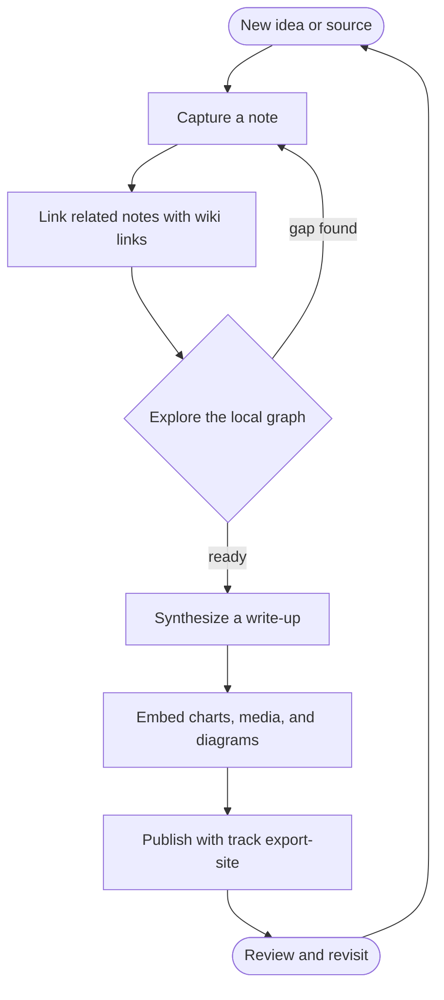

# Diagrams

track renders [Mermaid](https://mermaid.js.org/) diagrams as a first-class part of [[Visualization]] —
not only statistical [[Charts]]. **Every diagram type Mermaid supports works**, because track hands the
block straight to the Mermaid library: flowcharts, sequence, class, state, entity-relationship, Gantt,
pie, user-journey, gitgraph, and the rest.

Part of [[Visualization]] (see also [[Charts]] and [[Embeds]]). Back to [[track]].

## Writing a diagram

Fence a block with `mermaid` and write Mermaid syntax. It renders inline; if the syntax is wrong, the
original source is shown instead of a broken image, so a typo never hides your text.

## Diagrams as attachments

Prefer to keep a diagram in its own file? A `.mmd` / `.mermaid` text attachment renders with the same
engine — see [[Embeds]] for the standalone `` syntax. A diagram kept as a
separate file looks identical to one written inline.

## Viewing

In the [[Web workspace]] a rendered diagram is interactive: drag to pan, the wheel or the +/- buttons to
zoom toward the cursor, and ↺ to reset. A large diagram opens fitted to a readable size, so you can take
it in at a glance and explore the detail without scrolling the page. The published static export
([[CLI]] `export-site`) renders the same diagrams with the same engine.

tags:: help/visualization/diagrams
section:: visualization
cover:: assets/cover-diagrams.svg
