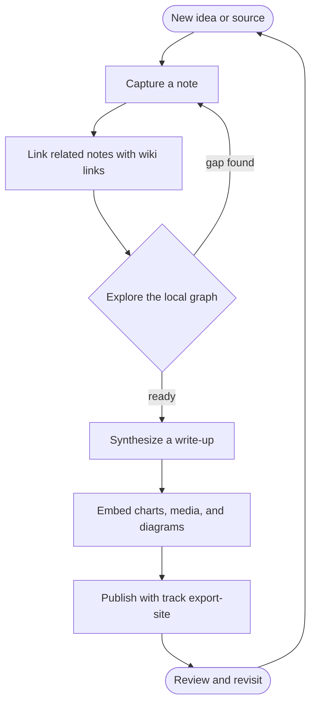

# Embeds

An embed is a standalone Markdown image link — `` **on its own line** — that track renders
as rich media instead of a plain ``. Inline image syntax inside a paragraph stays inline, so
embedding is always opt-in and ordinary `[text](url)` links are never turned into noisy previews. track
routes each embed by the kind of target (below); only `http(s)` and relative URLs feed an iframe, so a
note cannot smuggle a `javascript:` document into an embed.

Part of [[Visualization]] (see also [[Charts]]). Back to [[track]].

## Local files

Local media belongs under the vault's `assets/` directory. `track asset import ./image.png` copies the
file there and prints the relative reference you can paste into a note:

```markdown

```


A relative `assets/<file>` reference is served from the vault by the local server, so it is never
treated as a YouTube/tweet/OGP URL.

## YouTube

A YouTube watch, share, or embed URL becomes an inline player:

```markdown

```


## Twitter / X

A tweet URL renders the actual post via Twitter's official widgets (matching how Obsidian embeds
tweets), not just a link card. While the widget loads it shows a plain link, and if the post cannot be
rendered — deleted, blocked, or offline — it falls back to the generic Open Graph card:

```markdown

```


## PDF

A PDF (local asset or remote URL) opens in a paged slide-deck viewer rather than a download link:

```markdown

```

## Web pages (Open Graph)

Any other `http(s)` page becomes an Open Graph card — its title, description, and preview image pulled
from the page's `og:` metadata:

```markdown

```

## Text-file attachments

A text file imported with `track asset import` is fetched and rendered inline instead of shown as a
broken image. Any text file (`.txt`, `.json`, `.yaml`, `.csv`, shell scripts, …) renders as a
syntax-highlighted code block, and a Mermaid source (`.mmd` / `.mermaid`) renders as a diagram:

```markdown

```

A `.viewspec.json` attachment is a **chart** embed — see [[Charts]] for the View Spec that drives it.

## Mermaid diagrams

track has **full Mermaid support** — every diagram type works (flowchart, sequence, class, state,
Gantt, pie, …), because the block is handed straight to the Mermaid library. Write one inline with a
fenced ```mermaid``` block, or keep it in its own `.mmd` file and embed it as above:



If the syntax is wrong the original source is shown instead of a broken image, so a typo never hides
your text. In the [[Web workspace]] a rendered diagram is interactive — drag to pan, the wheel or the
+/- buttons to zoom toward the cursor, and ↺ to reset — and a large diagram opens fitted to a readable
size. The published static export ([[CLI]] `export-site`) renders the same output.
