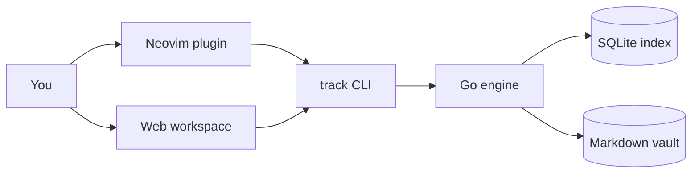

# track

track is a linked Markdown knowledge base. Notes are plain Markdown files; you connect them with
explicit `[[Title]]` wiki links, and a Go engine indexes the vault for search, link resolution, and a
local web workspace.

This help site is itself produced by `track export-site`, so it doubles as a working example of the
static-site export.

## Where to go next

- [[CLI]] — the command-line interface that owns parsing, indexing, and search.
- [[Linking notes]] — how `[[...]]` links, backlinks, and the note graph work.
- [[Web workspace]] — the local browser UI for reading, previewing, and navigating notes.

## How the pieces fit

The Go CLI is the source of truth: the Neovim plugin and the web workspace are thin frontends that
shell out to it. Reusable engine code lives under `internal/track/*` so other integrations can build on
it without depending on the command layer.
