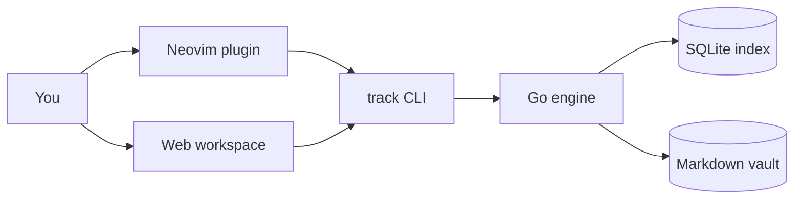

# track

track is a linked Markdown knowledge base. Notes are plain Markdown files; you connect them with
explicit `[[Title]]` wiki links, and a Go engine indexes the vault for search, link resolution, and a
local web workspace.

This help site is itself produced by `track export-site`, so it doubles as a working example of the
static-site export.

## Your workspace at a glance

The block below is a live [[Home dashboard]] widget — a `dashboard` fence the engine resolved into
recent notes and pinned links, the same way it renders in the local web workspace:

```dashboard
recent: 4
pinned:
  - Syntax
  - Web workspace
```

## Where to go next

- [[Syntax]] — the Markdown a note is written in: bold, math, tables, footnotes, and the Obsidian-style
  constructs.
- [[CLI]] — the command-line interface that owns parsing, indexing, and search.
- [[Searching notes]] — title, tag, and full-text body search, with ranking and CJK support.
- [[Linking notes]] — how `[[...]]` links, backlinks, and the note graph work.
- [[Tasks]] — checkbox lines with named states, priorities, deadlines, progress cookies, and a
  kanban board.
- [[Properties]] — typed key-value metadata on a note: sidecar props, inline `key:: value` fields,
  and an optional schema.
- [[Web workspace]] — the local browser UI for reading, previewing, and navigating notes.
- [[Home dashboard]] — a configurable landing note, embeddable dashboard widgets, and per-note icons.
- [[Visualization]] — how notes render as visuals: [[Diagrams]] (Mermaid, Graphviz, and D2), [[Mindmaps]]
  of a note's structure, [[Charts]] from a View Spec, and [[Embeds]] for YouTube, PDFs, tweets, and
  other rich media.
- [[Babel]] — run a note's fenced code blocks and keep their results in the sidecar.
- [[Web clipper]] — clip a web page's readable content into a note with `track-fetch-web`.

## How the pieces fit



The Go CLI is the source of truth: the Neovim plugin and the web workspace are thin frontends that
shell out to it. Reusable engine code lives under `internal/track/*` so other integrations can build on
it without depending on the command layer.
