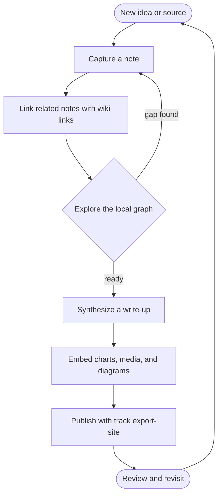
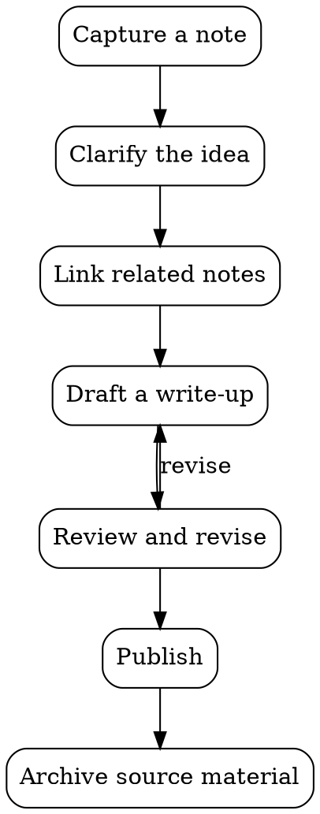

# Diagrams

track renders diagrams as a first-class part of [[Visualization]] — not only statistical [[Charts]].
Five engines are built in, each triggered by its fence language:

- **[Mermaid](https://mermaid.js.org/)** (` ```mermaid `) — **every diagram type Mermaid supports
  works**, because track hands the block straight to the Mermaid library: flowcharts, sequence, class,
  state, entity-relationship, Gantt, pie, user-journey, gitgraph, and the rest.
- **[Graphviz](https://graphviz.org/)** (` ```dot `) — the DOT language with Graphviz's own layout
  engine, for arbitrary graphs where you say *what connects to what* and let the layout be computed.
- **[D2](https://d2lang.com/)** (` ```d2 `) — a modern diagram language with its own themes and
  layout, when you prefer D2's syntax or aesthetics over Mermaid's for the same kind of diagram.
- **[LikeC4](https://likec4.dev/)** (` ```likec4 `) — one architecture model with multiple
  selectable views, such as a system overview and internal components.
- **[draw.io](https://www.drawio.com/)** (` ```drawio `) — not a text language but a drawing tool's
  file format: paste what draw.io saves (or attach the `.drawio` file) and track renders it with
  draw.io's own viewer, every built-in shape included.

See also [[Charts]], [[Mindmaps]], and [[Embeds]].

## Writing a diagram

Fence a block with `mermaid` and write Mermaid syntax. It renders inline; if the syntax is wrong, the
original source is shown instead of a broken image, so a typo never hides your text.

````markdown

````

It renders as:


Leave the colors to track. Mermaid is initialized with the current theme's own tokens, so a diagram
that names no colors is readable in light and dark alike and re-draws when you switch themes. Colors
written into the diagram — a `style` or `classDef` fill, or a `%%{init: …}%%` block setting
`themeVariables` — come through unchanged in both themes, so one of the two ends up showing a diagram
drawn for the other: dark text on a dark node, a pale line on a pale page. Where a distinction
matters, carry it with shape, label, or layout, which read the same either way.

## Mermaid architecture

Use `architecture-beta` inside a `mermaid` fence to describe services, their deployment groups, and
the sides their connections leave or enter. It works with the bundled Mermaid version; no separate
renderer or account is needed. Declare a group before its services, and services before their edges:

````markdown

````

It renders as:


`R`, `L`, `T`, and `B` choose the right, left, top, and bottom of a service. `-->` adds an arrow;
`--` connects without one. Connect services, not group IDs. To connect at a containing group's
boundary, use a service endpoint such as `api{group}:R`. `junction` adds a branching point.

The built-in icon names are `cloud`, `database`, `disk`, `internet`, and `server`. Track also bundles
the [Iconify Logos pack](https://icon-sets.iconify.design/logos/): names such as `logos:aws-lambda`,
`logos:postgresql`, and `logos:redis` work without fetching an icon from an external service. The pack
loads only when a diagram uses it. Other packs, custom pack registration, and icon URLs are not
supported; an unknown pack or icon appears as Mermaid's `?` placeholder. Logos keep their original
brand colors in both themes.

Architecture syntax is still named `architecture-beta`. Layout depends on connection directions,
and siblings with the same connections can overlap. `align column db cache` gives these two services
one column; use `align row` for one row. Put alignment after the services, and keep its order
consistent with their edge directions. Syntax or layout errors show the error and original source,
so the note remains editable. See the [Mermaid architecture reference](https://mermaid.js.org/syntax/architecture.html)
for the full grammar.

The web workspace, native app's note view, and published site all use this bundled renderer. Source
text is rendered on the device, with strict security and no external rendering service. The usual
diagram controls fit the first view to the text column, then let you pan, zoom, reset, or open a popup.

## Graphviz

Fence a block with `dot` (or `graphviz`) and write plain [DOT](https://graphviz.org/doc/info/lang.html).
Graphviz runs compiled to WebAssembly, right in the browser — nothing to install — and a syntax error
falls back to the message plus your source, the same as Mermaid:

````markdown

````

It renders as:


The graph background defaults to transparent so it sits on the page in both themes; set `bgcolor`
yourself to override it.

## D2

Fence a block with `d2` and write [D2](https://d2lang.com/tour/intro). Like Graphviz, D2 runs
compiled to WebAssembly in the browser, and a syntax error falls back to the message plus your
source. D2 brings its own themes: track picks a light or dark one to match the app theme, and a
theme set inside the diagram (`vars.d2-config`) still wins:

````markdown
```d2
capture: Capture a note
relate: Link related notes
draft: Draft a write-up
publish: Publish

capture -> relate -> draft -> publish
draft -> capture: gap found
```
````

It renders as:

```d2
capture: Capture a note
relate: Link related notes
draft: Draft a write-up
publish: Publish

capture -> relate -> draft -> publish
draft -> capture: gap found
```

### Architecture layouts with TALA

The bundled D2 0.9 renderer supports **Dagre** (the default), **ELK**, and **TALA**. TALA is useful
for software architecture with nested containers and connections that are not a simple hierarchy.
It runs on your device, including in the native app and published site: no plugin, license key,
account, or external rendering service is needed. Select it inside the diagram:

````markdown
```d2
vars: {
  d2-config: {
    layout-engine: tala
  }
}
direction: right
user: User
backend: Backend {
  api: API
  db: Database { shape: cylinder }
  api -> db: reads and writes
}
user -> backend.api: HTTPS
```
````

It renders as:

```d2
vars: {
  d2-config: {
    layout-engine: tala
  }
}
direction: right
user: User
backend: Backend {
  api: API
  db: Database { shape: cylinder }
  api -> db: reads and writes
}
user -> backend.api: HTTPS
```

Replace `tala` with `dagre` or `elk` to compare layouts. TALA can reposition much of a diagram after
a small edit; its result is not a fixed drawing. A misspelled layout name or invalid syntax shows an
error with the original source. The first visible D2 block loads the bundled WASM engine; later
blocks reuse it, with layouts processed in order. Large diagrams can take time.

Each fence or `.d2` attachment is a single source file: imports cannot read other attachments or
local files. Only the root board is shown. For safe inline rendering, active links, image icons,
foreign HTML, and externally loaded CSS are omitted. D2's generated styles and embedded fonts are
kept, so ordinary text, Markdown labels, shapes, and light/dark themes still render locally.
See the [D2 TALA guide](https://d2lang.com/tour/tala/) for layout-specific options.

## LikeC4

Use a `likec4` fence to describe one architecture model and derive several views from it. Change an
element or relationship once in `model`, then choose the view name above the drawing to inspect a
system overview or its internal components. Track bundles the [LikeC4](https://likec4.dev/) parser
and Graphviz renderer; the source stays in your browser, including in the native app and published
Web site.

````markdown
```likec4
specification {
  element person
  element system
  element component
}
model {
  user = person 'User'
  service = system 'Order service' {
    web = component 'Web UI'
    api = component 'Order API'
    db = component 'Database' {
      style { shape cylinder }
    }
  }
  user -> service.web 'Places orders'
  service.web -> service.api 'HTTPS'
  service.api -> service.db 'Reads and writes'
}
views {
  view overview {
    title 'System overview'
    include *
    autoLayout LeftRight
  }
  view components {
    title 'Internal components'
    include user, service.*
    autoLayout LeftRight
  }
}
```
````

It renders as:

```likec4
specification {
  element person
  element system
  element component
}
model {
  user = person 'User'
  service = system 'Order service' {
    web = component 'Web UI'
    api = component 'Order API'
    db = component 'Database' {
      style { shape cylinder }
    }
  }
  user -> service.web 'Places orders'
  service.web -> service.api 'HTTPS'
  service.api -> service.db 'Reads and writes'
}
views {
  view overview {
    title 'System overview'
    include *
    autoLayout LeftRight
  }
  view components {
    title 'Internal components'
    include user, service.*
    autoLayout LeftRight
  }
}
```

`specification` names the element kinds, `model` defines nested elements and their relationships,
and `views` selects what each diagram includes. `include *` shows the top-level overview;
`include user, service.*` expands the service's immediate children. Each view should have a distinct
name; `title` is the text shown in the view selector. Without a title, the view name is used. Track
shows explicitly declared views, so include at least one `view` in the source.

Switching views fits the newly selected diagram to the text column. Zoom, drag, Reset, popup and
Copy source use the same controls as the other SVG diagrams. Copy source copies the complete model
and all of its views. A `.c4` or `.likec4` attachment can be embedded with
`` and uses the same renderer.

The first visible LikeC4 block loads its parser and WebAssembly renderer. Off-screen blocks wait
until they approach the viewport. Each block is independent: it cannot import definitions from a
different fence, another note, or a project directory. Project configuration files, manual layout
files, the LikeC4 application, and its editor are not loaded. For those workflows, use LikeC4's own
tools and export a finished diagram.

The drawing is LikeC4's Graphviz SVG export. Its shapes and layout can differ from LikeC4's full
interactive viewer. External icons/images, interactive links, node-to-view navigation, animations,
HTML labels and custom CSS are omitted. Plain labels, relationships, nesting and supported Graphviz
shapes remain visible. No external rendering service or icon service receives the source.

A block supports up to 100,000 characters, 24 declared views, and 500 elements in each view. Parsing
and drawing run in an isolated worker and stop after 30 seconds. Invalid syntax, unresolved names,
missing views, size limits and rendering failures show an error with the original source; syntax
and reference errors include the source line. Reduce a large model or split it into self-contained
blocks when a limit is reached.


## draw.io

The text engines above describe diagrams you write; draw.io is a diagram you *draw* in
[draw.io / diagrams.net](https://www.drawio.com/) and keep in the note as-is. Fence a block with
`drawio` and paste the file draw.io saves — the `<mxfile>` XML, compressed or not; both decode —
or attach the `.drawio` file itself. track bundles draw.io's own static viewer, so shapes beyond
the basics (AWS and UML sets, mockups, all the stencils) render exactly as the editor shows them,
offline. The first page of a multi-page file is shown. A `.drawio.svg` / `.drawio.png` export is
an ordinary image to track — it embeds like any picture, and keeps its source for round-tripping
back into the editor.

```drawio
<mxfile>
  <diagram name="Page-1">
    <mxGraphModel>
      <root>
        <mxCell id="0" />
        <mxCell id="1" parent="0" />
        <mxCell id="2" value="Draft" style="rounded=1;fillColor=#dae8fc;" vertex="1" parent="1">
          <mxGeometry x="40" y="40" width="100" height="40" as="geometry" />
        </mxCell>
        <mxCell id="3" value="Published" style="rounded=1;fillColor=#d5e8d4;" vertex="1" parent="1">
          <mxGeometry x="220" y="40" width="100" height="40" as="geometry" />
        </mxCell>
        <mxCell id="4" style="edgeStyle=orthogonalEdgeStyle;" edge="1" parent="1" source="2" target="3">
          <mxGeometry relative="1" as="geometry" />
        </mxCell>
      </root>
    </mxGraphModel>
  </diagram>
</mxfile>
```

## Diagrams as attachments

Prefer to keep a diagram in its own file? A `.mmd` / `.mermaid` attachment renders with the Mermaid
engine, a `.dot` / `.gv` attachment with Graphviz, a `.d2` attachment with D2, a `.c4` / `.likec4`
attachment with LikeC4, and a `.drawio`
attachment with the draw.io viewer — see [[Embeds]] for the standalone ``
syntax. A diagram kept as a separate file looks identical to one written inline.

## Viewing

In the [[Web workspace]] and the published static export ([[CLI]] `export-site`), Mermaid,
Graphviz, D2, and LikeC4 diagrams initially fit their whole width inside the same text column as the
surrounding paragraphs. The controls and drawing stay within that column, including with a right
sidebar, in split panes, in included notes, and on narrow screens. The popup provides more room
without widening the inline diagram.

A very wide diagram may initially have small labels. Use **+** / **−** to zoom, **Shift+wheel** or a
trackpad pinch to zoom toward the cursor, and drag to pan. A horizontal trackpad swipe pans when the
zoomed drawing is wider than its viewport; an ordinary vertical wheel scrolls the page. **Open diagram
in popup** gives the drawing its own larger window, with the same controls and an explicit close button.

**Reset diagram view** returns to the fitted overview. Changing the window or content width refits
an untouched diagram automatically. After you pan or zoom, your view stays put; Reset fits it to the
new space. Tall diagrams can be collapsed to a short preview and expanded again, and track remembers
your fold choice for that diagram's source.
