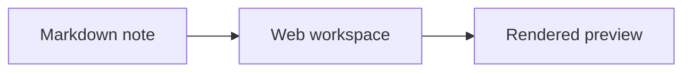

# Web workspace

`track web` serves a local browser workspace for reading and navigating the vault. It is a thin
frontend over the [[CLI]]: it renders note bodies, resolves `[[...]]` links into navigable,
hover-previewable anchors, and draws the note graph.

Back to [[track]].

## What it offers

- Rendered Markdown reading with GFM tables, task lists, and Mermaid diagrams.
- Hover previews and persistent floating windows for linked notes and media.
- A local link graph you can open per-note or full-screen.
- Follow mode, so the web view tracks the note you are editing in Neovim.

## Media embeds

Put a Markdown image link on its own line to turn it into a block embed. Local files belong under the
note kind's assets directory, and `track asset import ./image.png` prints the relative reference you
can paste into a note.


The image above is just:

```markdown

```

The same standalone image syntax also embeds YouTube videos, Twitter/X posts, PDFs, image URLs, and
ordinary web pages with Open Graph metadata. Inline image syntax inside a paragraph stays inline.

Text-file attachments work the same way. Import a text file with `track asset import` and embed the
reference: a Mermaid source (`.mmd` / `.mermaid`) renders as a diagram, and any other text file
(`.txt`, `.json`, `.yaml`, `.csv`, shell scripts, …) renders as a syntax-highlighted code block.

```markdown

```

## Code and diagrams

Fenced code blocks are syntax highlighted when the language is named. The web reader also adds a copy
button to each block.

```go
func Title(text string) string {
	return strings.TrimSpace(text)
}
```

Use a `mermaid` fence for diagrams; the web reader renders it inline and shows the original source if
the diagram has a syntax error. The same renderer also backs an embedded `.mmd` / `.mermaid` attachment
(see [Media embeds](#media-embeds)), so a diagram kept as a separate file renders identically.



## Relationship to the static export

The static site produced by `track export-site` is the *published* counterpart of this workspace:
rendered content only, with no editor, search index, or heatmap top page. It reuses the same Markdown
and Mermaid rendering so a published note reads the way it does here, while [[Linking notes]] explains
how cross-note links are resolved against the published set.
